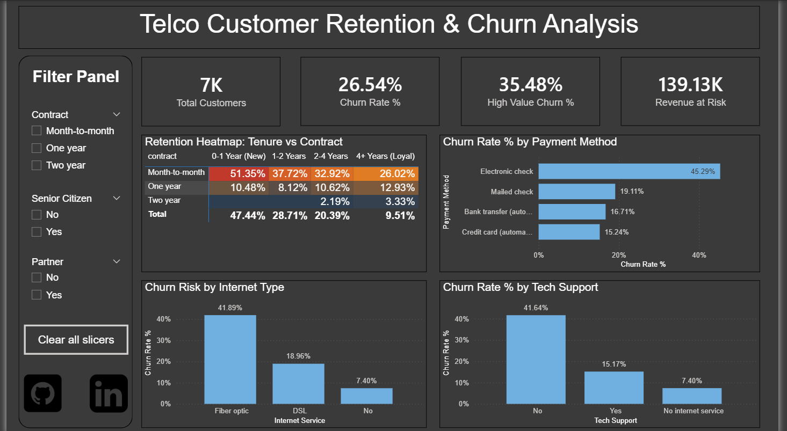

# 📉 Why Are Customers Leaving? (Telco Churn Analysis)

### 🚀 The Challenge
We've all been there signing up for a service and then cancelling it a few months later. But for a Telecom company, that cancellation isn't just annoying; it's expensive.

I wanted to dig into a dataset of **7,000+ customers** to answer a simple question: **Who is leaving, and why?**

My goal wasn't just to build a pretty chart. I wanted to find the "bleeding points" where the company is losing the most money and figure out how to stop it.

---

### 💡 What I Found
After cleaning the data in SQL and visualizing it in Power BI, the story became clear. It wasn't just random people leaving; there were specific patterns:

1.  **The "High Value" Trap:**
    My analysis showed that **High Value Customers** (paying >$70/mo) are actually *more* likely to leave (35% churn) than the average user. This is a massive revenue leak ($139k/month at risk).

2.  **The "Fiber Optic" Problem:**
    I expected Fiber Optic users to be happy because the internet is faster. Instead, they are churning at **42%** (double the rate of DSL users). This strongly suggests a technical service quality issue.

3.  **The "Electronic Check" Friction:**
    Surprisingly, customers who pay by "Electronic Check" are leaving in droves. Users on automatic credit card payments are much stickier.

---

### 🛠️ How I Built This
I didn't just drag-and-drop. I wanted to simulate a real-world analyst workflow.

**Step 1: The Cleanup (SQL)**
The raw data was a bit messy (as real data always is). I used PostgreSQL to:
* Handle null values in the `TotalCharges` column.
* Create new segments like "New Users" vs. "Loyalists" using `CASE` statements.
* Flag "High Risk" accounts before bringing the data into the BI tool.

**Step 2: The Logic (DAX)**
I avoided implicit measures. Instead, I wrote custom DAX formulas to calculate:
* `Revenue at Risk` (Total monthly charges of churned users).
* `Churn Rate %` (To normalize the data across different group sizes).

**Step 3: The Dashboard (Power BI)**
I designed the final dashboard to be an "Executive War Room."
* **Red = Danger:** I used conditional formatting in the heatmap to instantly draw the eye to the Month-to-Month users (who churn at >50%).
* **Interactive:** The slicers on the left let you drill down by Contract Type or Demographics to see how different groups behave.

---

### 📂 Project Files
* **`Telco_Customer_Retention_and_Churn_Analysis.pbix`**: The full Power BI Dashboard (download to play with the interactive visuals).
[Click Here to Download Dashboard](Telco_Customer_Retention_and_Churn_Analysis.pbix)
* **`SQL_Scripts`**: All the queries I used to clean and transform the data.
[Click Here for SQL Scripts](SQL_Scripts)

---

### 📬 Connect with Me
If you have questions about the SQL logic or just want to chat about data, feel free to reach out!

* pratikkafle65@gmail.com
* [LinkedIn Profile Link](https://www.linkedin.com/in/pratik-kafle)
* [Portfolio Link](https://github.com/Pratik-Kafle)